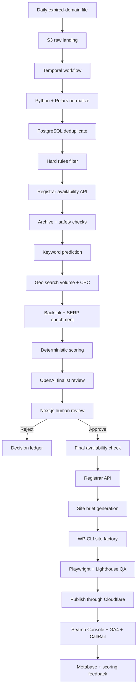

# Machine architecture

The pipeline is one durable workflow. Each stage writes its evidence and status before the next stage starts.

## Moving parts

| # | Moving part | Recommended technology | Output |
|--:|:--|:--|:--|
| 1 | Receive feed | S3 + EventBridge | Immutable raw file |
| 2 | Control run | Temporal Cloud | Durable workflow state |
| 3 | Parse at volume | Python + Polars | Normalized rows |
| 4 | Deduplicate | PostgreSQL | Canonical domains |
| 5 | Apply rules | Python + versioned YAML | Qualified shortlist |
| 6 | Check availability | Registrar API | Registerable domains only |
| 7 | Inspect history | Internet Archive CDX | Topic and abuse timeline |
| 8 | Check safety | Google Safe Browsing + DNS | Risk signals |
| 9 | Predict keywords | Python taxonomy + OpenAI | Candidate keyword universe |
| 10 | Measure local demand | DataForSEO | Geo volume, CPC, competition |
| 11 | Measure SEO strength | DataForSEO Backlinks + SERP | Link and ranking evidence |
| 12 | Score candidates | Python service | Versioned component scores |
| 13 | Review finalists | OpenAI Structured Outputs | Buy/review/reject evidence |
| 14 | Approve manually | Next.js console | Audited decision |
| 15 | Register | Registrar API | Domain and DNS record |
| 16 | Generate site | OpenAI + structured facts | Site brief and content package |
| 17 | Build WordPress | WP-CLI + REST API | Staging site |
| 18 | Test | Playwright + Lighthouse CI | Launch gate |
| 19 | Publish | GitHub Actions + Cloudflare | Live site |
| 20 | Learn | Search Console + CallRail + Metabase | Updated scoring evidence |

## Orchestrator choice

Use Temporal Cloud for the core pipeline. Hundreds of thousands of rows, long-running enrichment, provider rate limits, retries, and partial failures require durable execution.

Use n8n only for peripheral automation:

- Slack or email alerts
- Approval notifications
- CRM updates
- Daily digest delivery
- Simple webhook routing
