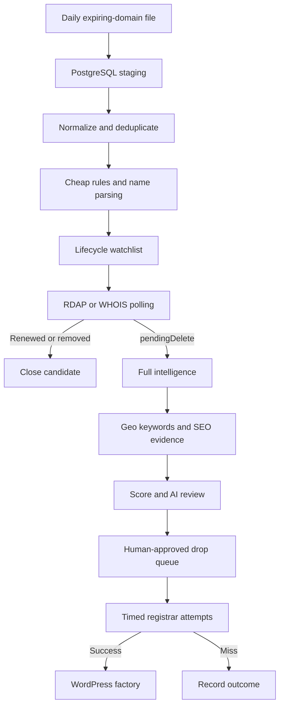

# Machine architecture

The machine is a PostgreSQL-first pipeline with two enrichment stages. The expiring feed creates a watchlist; registry status determines when a candidate is close enough to a real drop to justify full intelligence.

## Moving parts

| # | Moving part | Recommended technology | Output |
|--:|:--|:--|:--|
| 1 | Download expiring feed | Python scheduled worker | Temporary CSV/ZIP file |
| 2 | Bulk ingest | PostgreSQL unlogged staging + `COPY` | Imported feed run |
| 3 | Normalize and deduplicate | SQL + Python/Polars | Canonical domains and observations |
| 4 | Parse service and geography | Python taxonomy | Structured name features |
| 5 | Apply cheap filters | Python + versioned YAML | Lifecycle watchlist |
| 6 | Track registry state | RDAP first; WHOIS fallback | Status history and drop estimate |
| 7 | Inspect history and safety | Internet Archive CDX + Safe Browsing | Risk timeline |
| 8 | Predict keywords | Service taxonomy + OpenAI | Candidate keyword clusters |
| 9 | Measure local demand | DataForSEO | Geo volume, CPC, competition |
| 10 | Measure SEO strength | DataForSEO Backlinks + SERP | Link and ranking evidence |
| 11 | Score candidates | Versioned Python service | Ranked drop-day queue |
| 12 | Review finalists | OpenAI Structured Outputs + human UI | Approved attempt plan |
| 13 | Attempt registration | Two or more registrar APIs | Registration result |
| 14 | Generate site | OpenAI + structured facts | Site brief and content package |
| 15 | Build WordPress | WP-CLI + REST API | Staging site |
| 16 | Test and publish | Playwright, Lighthouse, Cloudflare | Live, verified site |
| 17 | Learn | Search Console, CallRail, Metabase | Scoring feedback |

## Orchestration

Start with scheduled Python workers and PostgreSQL job tables. Move to Temporal Cloud when retry chains, provider rate limits, concurrent drop attempts, and long-running workflows become operationally difficult.

Use n8n for peripheral work such as alerts, approval notices, CRM updates, and daily summaries. Do not make it the high-volume row processor.
