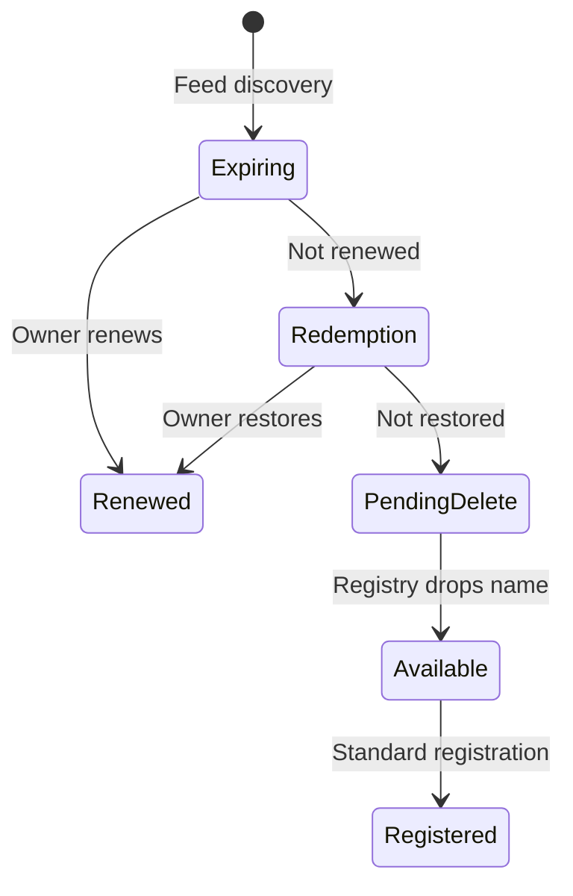

# Domain lifecycle

An expiration date is not a drop date. For many generic top-level domains, a name can pass through renewal and redemption periods before it is released. The exact timing and policy depend on the registry and registrar.



For `.com`, the common working model is expiration, a registrar-controlled auto-renew grace period that can last up to 45 days, a 30-day redemption period, and a 5-day `pendingDelete` period. Do not calculate a purchase date by simply adding a fixed number of days to expiration. Confirm status through RDAP or WHOIS and follow the registry state.

See the [ICANN domain lifecycle explanation](https://www.icann.org/resources/pages/gtld-lifecycle-2012-02-25-en) and [Expired Registration Recovery Policy](https://www.icann.org/resources/pages/errp-2013-02-28-en).

## Two-stage intelligence

| Stage | Trigger | Work allowed |
|:--|:--|:--|
| Early screen | Appears in expiring feed | Parse name, service/geo fit, exclusions, prior decisions, cheap archive signals |
| Watch | Survives early screen | Poll RDAP/WHOIS, record lifecycle changes, refresh basic risk evidence |
| Full intelligence | `pendingDelete` confirmed | Backlinks, archive review, keyword prediction, geo-volume API calls, SERP analysis, scoring |
| Final queue | Drop window known | Human approval, registrar routing, attempt schedule, fallback list |

The early stage can run weeks before a possible drop. The expensive stage should run close enough to the drop that its evidence remains current and only on domains likely to become registerable.

## Required lifecycle fields

```text
registry_status
registrar_expiration_at
registry_expiration_at
pending_delete_seen_at
predicted_drop_at
drop_window_start
drop_window_end
lifecycle_checked_at
lifecycle_source
lifecycle_confidence
```

Store observed facts separately from predicted timestamps. Every prediction must identify the rule version and evidence used.
